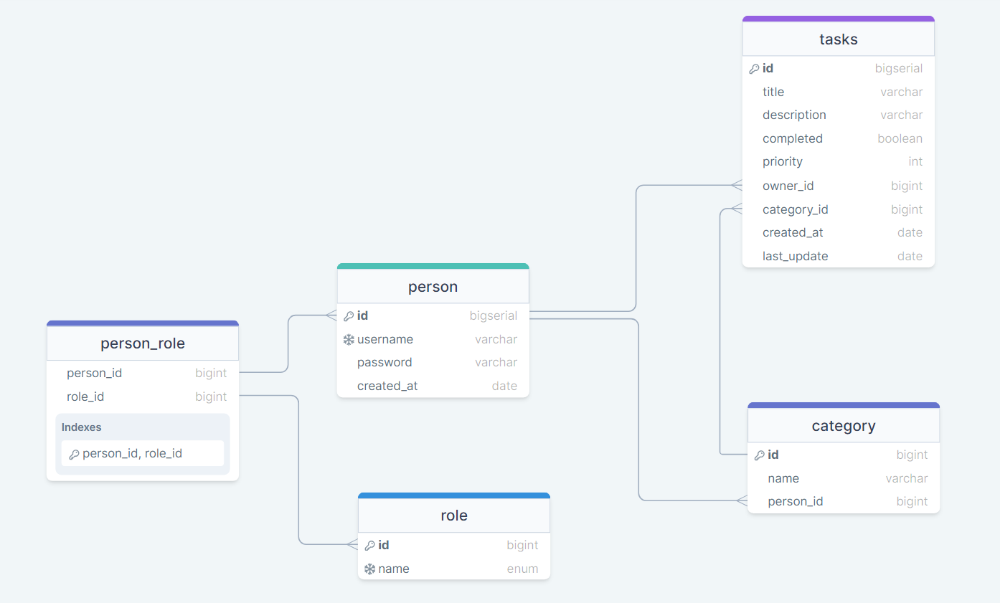
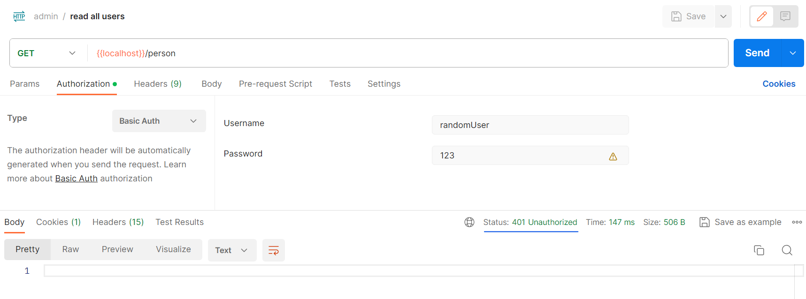
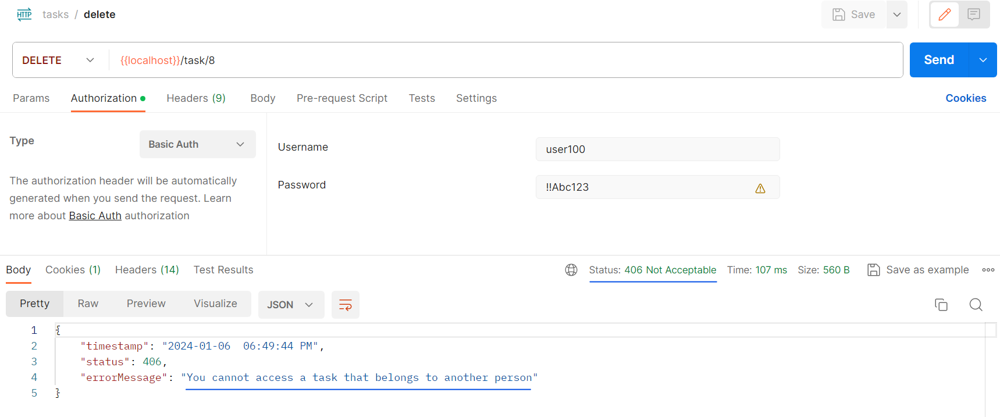
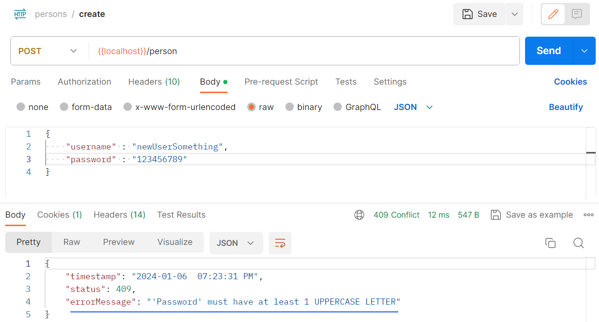
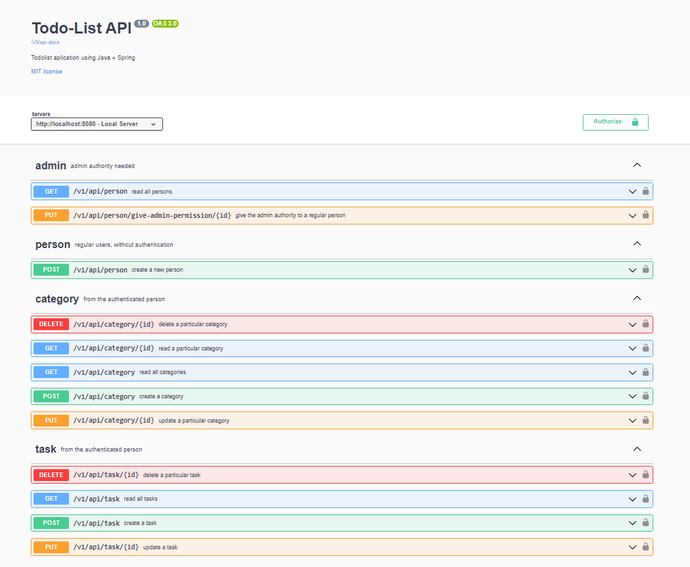

<!-- title -->
<h1 align="center">
    <span>Todo List API</span>
    
</h1>

<!-- badges -->
<div align="left">
    </img>
    </img>
    </img>
</div>

<!-- languages -->
<div align="right">
    <span><em>language</em></span>
    <!-- BR -->
    <a href="./src/main/resources/static/README_pt_br.md">
        
    </a>
    <!-- US -->
    <a href="#">
        
    </a>
</div>

<!-- About -->
##  About the project
This is a TodoList API designed for managing your daily tasks. The objetive here is practice the CRUD operations, using as background a todolist.

### How the API works
1. User will create an account (authentication).
2. User will create a category.
3. After those 2 steps, the user can start to create their own tasks and manage them.

<hr>
<br>

<!-- Technologies -->
##  Technologies
- Java
- Maven
- Spring Boot
- Spring Web
- Spring Data JPA
- PostgreSQL Driver
- OpenAPI (Swagger)
- Spring Security
- Mockito and AssertJ

<hr>
<br>

<!-- Functionalities -->
##  Functionalities

- [x] Entities Relatioship
- [x] Authentication (Basic Auth)
- [x] Create, Read, Update and Delete tasks
- [x] Attributes validation
- [x] Custom Exception Handler
- [x] Unit Tests, with AssertJ and Mockito
- [x] Swagger documentation

<br>
<hr>

<!-- Diagram -->
###  Entities Relationship Diagram

The application works with 4 entities:
- User
- Role (*ADMIN*, *REGULAR_USER*)
- Category
- Tasks



<hr>
<br>

<!-- Authentication -->
###  Authentication (Basic Auth)
When we are talking about 'basic auth', we are talking about **users** and **roles**.

All the endpoints are restricted and need to receive a credential to be accessed. Besides that, the user need to have a particular authority as well.

Our basic authentication works with 2 roles:

- **REGULAR_USER** -> As the name suggest, it is a normal/regular authority. By default, everytime a user is created, that new user receives the REGULAR_USER authority.

<br>

- **ADMIN** -> Special authority that allowed a user to access sensitive endpoints. By default, the application going to create a user called "admin" with a password "123". That 'default admin account' will be the responsable to give the admin authority to a regular user. After you have a user with admin authority, you dont need to use that 'default admin account' anymore.

Working with users and roles, we can assert that users can only manipulate their own tasks. Not allowed to access informations about others users tasks.

<br>

####  Screenshot examples:

**403 - Forbidden**


<br>

**401 - Unauthorized**


<br>

**406 - Not Acceptable**


<hr>
<br>

##  Endpoints

### Person Controller

| Http Method | URI                                                               | Description                           | Authority needed |
| :---:       | :---                                                              |  :---                                 |  :---:           | 
| POST        | `http://localhost:8080/v1/api/person`                             | Create a user                         | permit all       |
| PUT         | `http://localhost:8080/v1/api/person/give-admin-permission/{id}`  | Give admin authority to a user        | ADMIN            |
| GET         | `http://localhost:8080/v1/api/person`                             | Read all users                        | ADMIN            |

<br>

### Category Controller
| Http Method    | URI                                           | Description                | Authority needed |
| :---:          | :---                                          |  :---                      |  :---:           | 
| POST           | `http://localhost:8080/v1/api/category`       | Create a category          | REGULAR_USER     |
| GET            | `http://localhost:8080/v1/api/category`       | Read all categories        | REGULAR_USER     |
| GET            | `http://localhost:8080/v1/api/category/{id}`  | Read a particular Category | REGULAR_USER     |
| PUT            | `http://localhost:8080/v1/api/category/{id}`  | Update a category          | REGULAR_USER     |
| DELETE         | `http://localhost:8080/v1/api/category/{id}`  | Delete a category          | REGULAR_USER     |

<br>

### Task Controller
| Http Method    | URI                                                | Description            | Authority needed |
| :---:          | :---                                               |  :---                  |  :---:           | 
| POST           | `http://localhost:8080/v1/api/task`                | Create a task          | REGULAR_USER     |
| GET            | `http://localhost:8080/v1/api/task`                | Read all tasks         | REGULAR_USER     |
| PUT            | `http://localhost:8080/v1/api/task/{id}`           | Upadte a task          | REGULAR_USER     |
| DELETE         | `http://localhost:8080/v1/api/task/{id}`           | Delete a task          | REGULAR_USER     |

<br>

⚠️ As you saw above, the only endpoint you can access without any authentication is the endpoint to create a user. To access all the others endpoints, you need to be authenticated. Otherwise, you will get a 401 - Unauthorized.

<hr>
<br>

<!-- Validations -->
##  Validations
To avoid any input problem, all the attributes were validated.

The validations that were implemented are:

### Person input validations

-  **CREATE**
    - 'username' attribute:
        1. username cannot be null
		2. username cannot have white space
		3. username must have between 5 e 20 characters
		4. username must to be unique

    <br>

    - 'password' attribute:
        1. password cannot be null
		2. password must have between 8 and 20 characters
		3. password cannot have white spaces
		4. password must have at least 1 uppercase letter
		5. password must have at least 1 number
		6. password must have 2 special characters
<br>

### Category input validations
- **CREATE**
    - 'name' attribute
        1. name cannot be null
        2. name must have betweem 1 and 20 characters
        3. cannot have categories with the same name
<br>

- **UPDATE**
    - 'name' attribute
        1. name must have between 1 and 20 characters
        2. name must be unique

<br>

### Task input validations
- **CREATE**
    - 'title' attribute
        1. title cannot be null
        2. title must have between 1 and 50 characters
        3. title must to be unique
    <br>

    - 'description' attribute
        1. description cannot be null and must have between 0 and 100 characters
    <br>

    - 'priority' attribute
        1. priority cannot be null
		2. priority must be between 1 and 3
		3. priority cannot be a String
    <br>

     - 'category_id' attribute
        1. category_id cannot be null
        2. category_id cannot be a String
        3. cannot pass a category_id from another person
	<br>

- **UPDATE**
    - 'title' attribute
        1. title must have between 1 and 50 characters
        2. title must to be unique

    <br>

    - 'description' attribute
        1. description cannot be null and must have between 0 and 100 characters

    <br>

    - 'priority'
        1. priority must be between 1 and 3
	    2. priority cannot be a String

    <br>
    
    - 'category_id' attribute
        1. category_id cannot be a String
        2. cannot pass a category_id from another person
<hr>
<br>

<!-- Custom Exception Handler -->
##  Custom Exception Handler

All the exceptions were customized for a better user understanding

**Example 1**
	
	
**Example 2**
	

<hr>
<br>

## Swagger documentation

	

<br>

For each operation, we show all the possible responses
	

<hr>
<br>

<!-- Build and run -->
##  Build and run

### Requirements
- [Java 17](https://www.oracle.com/java/technologies/javase/jdk17-archive-downloads.html)
- [PostgreSQL 16](https://www.postgresql.org/download/)
- [git 2.34.1](https://git-scm.com/download)

<br>

### Step by step

1. Clone the repository in a local repository
    ```bash
    git clone git@github.com:lGabrielDev/todolist_backend.git
    ```
<br>

2. Setup the application.properties:

    ```properties
    # Database path
    spring.datasource.url=jdbc:postgresql://localhost:5432/your_database

    # postgres username
    spring.datasource.username=yourPostgresUsername

    # postgres password
    spring.datasource.password=yourPostgresPassword

    # Every time we update a entity, the reference table will update as well
    spring.jpa.hibernate.ddl-auto=update

    # Show the SQL commands
    spring.jpa.show-sql=true

    # Swagger sorted operations
    springdoc.swagger-ui.operationsSorter=method
    ```
<br>

3. Run the application and access the endpoint: `http://localhost:8080/swagger-ui/index.html`

<br>

4. Create a user

5. Create a category

6. Create your taks and have fun! 😎

<br>
<div>
    <span>For more detailed informations, watch the tutorial video here</span>
    <a href="https://www.youtube.com/watch?v=IGdVJ5rxb6o&ab_channel=lGabrielDev">
        
    </a>
</div>
<hr>
<br>
<!-- License -->
<h2>
    <span>License</span>
    
</h2>
<p>This project is under the <a href="https://opensource.org/license/mit/"> MIT </a> license.</p>

<hr>
<br>
<!-- Author -->
<h2>
	
	<span>Author</span>
</h2>


<br>
<div align="center">
    
    <p> <a href="https://github.com/lGabrielDev">Gabriel Freitas</a> 😎</p>
</div>
