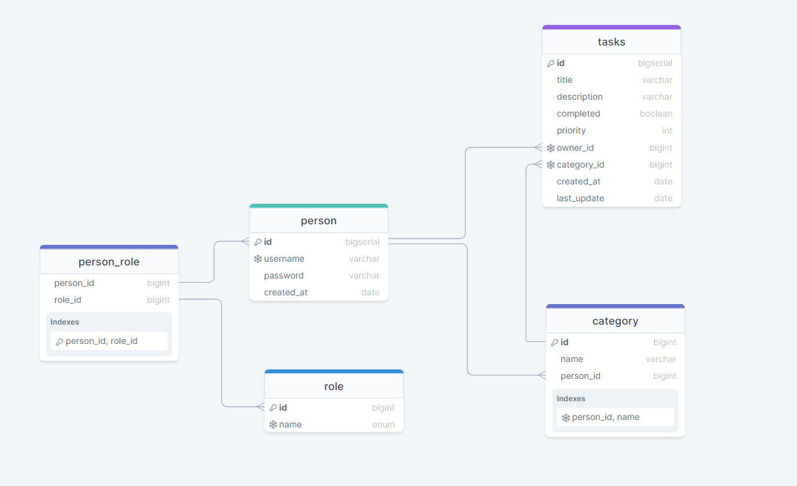
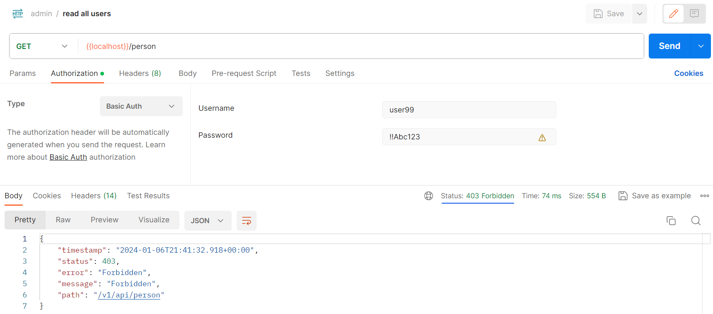
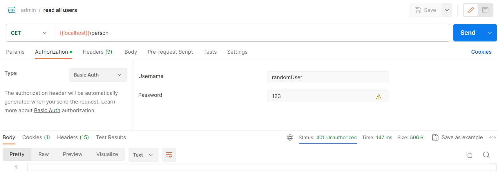
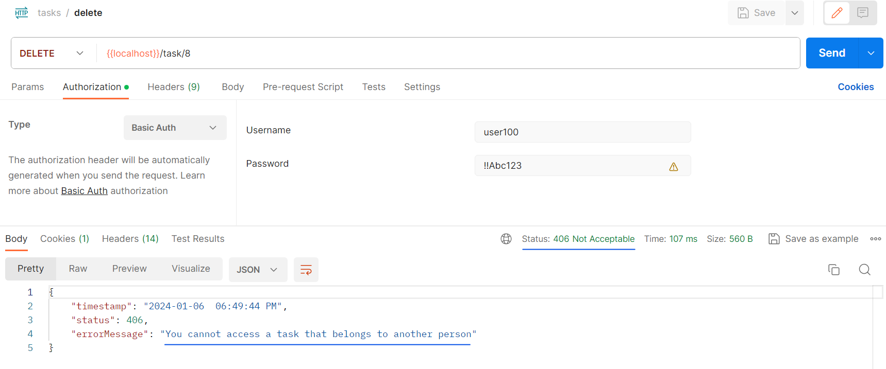
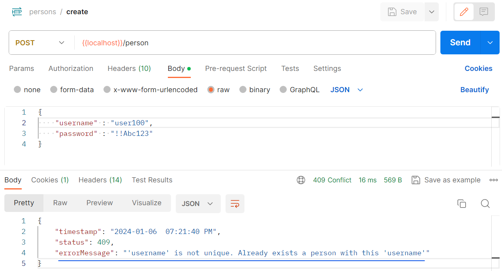
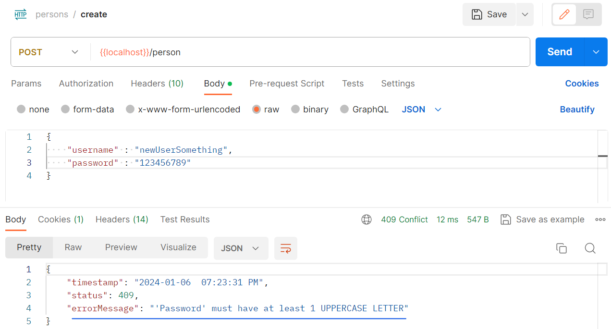
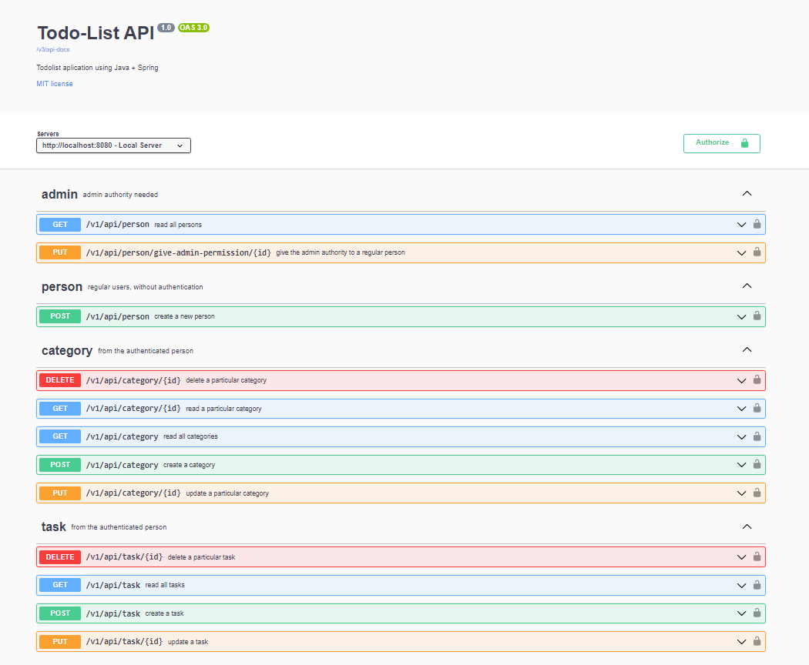
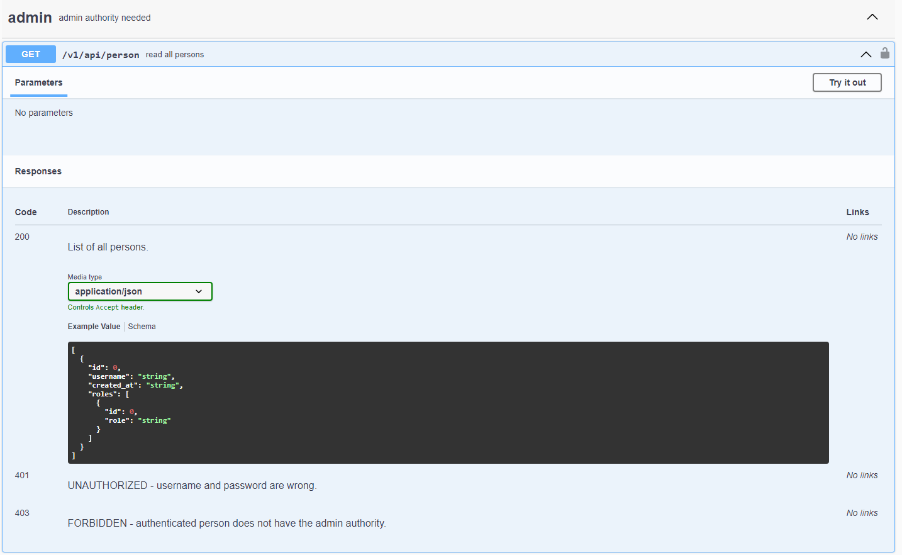

<!-- title -->
<h1 align="center">
    <span>Todo List API</span>
    
</h1>

<!-- badges -->
<div align="left">
    </img>
    </img>
    </img>
</div>

<!-- languages -->
<div align="right">
    <span><em>language</em></span>
    <!-- BR -->
    <a href="#">
        
    </a>
    <!-- US -->
    <a href="../../../../README.md">
        
    </a>
</div>

<!-- About -->
##  Sobre o Projeto
Essa é uma todolist criada para manipular tarefas diárias. O Objetivo aqui é praticar as operações CRUD, usando como plano de fundo uma lista de tarefas.

### Como a API funciona?

1. O usuário vai criar uma conta.
2. O usuário vai criar uma categoria de tarefas.
3. Depois dessas 2 etapas, o usuário vai criar suas tarefas e gerenciá-las.

<hr>
<br>

<!-- Technologies -->
##  Tecnologias
- Java
- Maven
- Spring Boot
- Spring Web
- Spring Data JPA
- PostgreSQL Driver
- OpenAPI (Swagger)
- Spring Security
- Mockito and AssertJ

<hr>
<br>

<!-- Functionalities -->
##  Funcionalidades

- [x] Relacionamento entre Entidades
- [x] Autenticação (Basic Auth)
- [x] Create, Read, Update e Delete tasks
- [x] Validação de attributes inputados
- [x] Lancamento de exceções customizadas
- [x] Testes unitários, trabalhando com AssertJ e Mockito
- [x] Documentação no Swagger

<br>
<hr>

<!-- Diagram -->
###  Diagrama de relacionamento entre Entidades

A aplicação trabalha com 4 entidades:

- User
- Role (*ADMIN*, *REGULAR_USER*)
- Category
- Tasks



<hr>
<br>

<!-- Authentication -->
###  Authentication (Basic Auth)
Quando falamos sobre autenticação básica, estamos falando sobre trabalhar com **usuarios** e **cargos/autoridades**.

Todas as rotas estão restritas e necessitam de autorização para serem acessadas. Além disso, o usuário precisa ter um cargo específico para conseguir acessá-las.

Nossa autenticação básica vai trabalhar com 2 tipos de cargos:

- **REGULAR_USER** -> Como o nome sugere, é um usuário normal/regular. Por padrão, toda vez que um usuário é criado, esse novo usuário recebe o cargo de *REGULAR_USER*.

<br>

- **ADMIN** -> Cargo especial que permite o usuário a acessar rotas 'sensíveis'. Por padrão, a aplicação vai criar um usuário chamado "admin" com a senha "123". Essa 'conta de admin padrao' vai ser responsável em dar cargos de *admin* para usuários normais. Depois de você já possuir usuários com cargo de admin, não é mais necessário utilizar essa 'conta de admin padrao'.

Trabalhando com usuários e cargos, nós garantimos que usuários consigam manipular apenas suas próprias tarefas. Não sendo permitido acessar informações de tarefas de outros usuários.

<br>

####  Imagens de exemplo:

**403 - Forbidden**



<br>

**401 - Unauthorized**


<br>

**406 - Not Acceptable**


<hr>
<br>

##  Endpoints

### Person Controller

| Método Http | URI                                                               | Descrição                                   | Cargo necessário |
| :---:       | :---                                                              |  :---                                       |  :---:           | 
| POST        | `http://localhost:8080/v1/api/person`                             | Criar usuário                               | permissao total  |
| PUT         | `http://localhost:8080/v1/api/person/give-admin-permission/{id}`  | Dar permissao de admin para um usuario      | ADMIN            |
| GET         | `http://localhost:8080/v1/api/person`                             | Listar todos os usuarios                    | ADMIN            |

<br>

### Category Controller
| Método Http    | URI                                           | Descrição                         | Cargo necessário |
| :---:          | :---                                          |  :---                             |  :---:           | 
| POST           | `http://localhost:8080/v1/api/category`       | Criar categoria                   | REGULAR_USER     |
| GET            | `http://localhost:8080/v1/api/category`       | Listar todas as categorias        | REGULAR_USER     |
| GET            | `http://localhost:8080/v1/api/category/{id}`  | Ler uma categoria específica      | REGULAR_USER     |
| PUT            | `http://localhost:8080/v1/api/category/{id}`  | Atualizar categoria               | REGULAR_USER     |
| DELETE         | `http://localhost:8080/v1/api/category/{id}`  | Deletar categoria                 | REGULAR_USER     |

<br>

### Task Controller
| Método Http    | URI                                                | Descrição                       | Cargo necessário |
| :---:          | :---                                               |  :---                           |  :---:           | 
| POST           | `http://localhost:8080/v1/api/task`                | Criar tarefa                    | REGULAR_USER     |
| GET            | `http://localhost:8080/v1/api/task`                | Listar todas as tarefas         | REGULAR_USER     |
| PUT            | `http://localhost:8080/v1/api/task/{id}`           | Atualizar tarefa                | REGULAR_USER     |
| DELETE         | `http://localhost:8080/v1/api/task/{id}`           | Deletar tarefa                  | REGULAR_USER     |

<br>

⚠️ Como voce pode perceber acima, a única rota que você consegue acessar sem precisar de autenticação é a rota para criar um novo usuário. Para acessar qualquer outra rota, você precisa estar autenticado. Caso contrário, você irá receber o erro 401 - Unauthorized.

<hr>
<br>

<!-- Validations -->
##  Validações
Para evitar qualquer problema, todos os atributos foram validados.

As validações implementadas foram:
### Validações de input da entidade (Person)

-  **CREATE**
    - 'username':
        1. username não pode ser nulo
		2. username não pode ter espaços em branco
		3. username deve possuir entre 5 e 20 caracteres
		4. username deve ser único

    <br>

    - 'password':
        1. password não pode ser nulo
		2. password deve possuir entre 8 e 20 caracteres
		3. password não pode ter espaços em branco
		4. password deve possuir pelo menos 1 letra MAIÚSCULA
		5. password deve possuir pelo menos 1 número
		6. password deve ter pelo menos 2 caraceteres especiais ('!', '@', '#' '=', etc...)
<br>

### Validações de input da entidade (Category)
- **CREATE**
    - 'name':
        1. name não pode ser nulo
        2. name deve possuir entre 1 e 20 caracteres
        3. name deve ser único

<br>

- **UPDATE**
    - 'name':
        1. name deve possuir entre 1 e 20 caracteres
        2. name deve ser único

<br>

### Validações de input da entidade (Task)
- **CREATE**
    - 'title':
        1. title não pode ser nulo
        2. title deve possuir entre 1 e 50 caracteres
        3. title deve ser único

    <br>

    - 'description':
        1. description não pode ser nulo e deve possuir entre 0 e 100 caracteres

    <br>

    - 'priority':
        1. priority não pode ser nulo
		2. priority o número deve ser entre 1 e 3
		3. priority não pode ser uma String

    <br>

     - 'category_id':
        1. category_id não pode ser nulo
        2. category_id não pode ser uma String
        3. category_id não pode ser de outro usuário

	<br>

- **UPDATE**
    - 'title':
        1. title deve possuir entre 1 e 50 caracteres
        2. title deve ser único

    <br>

    - 'description' attribute
        1. description não pode ser nulo e deve possuir entre 0 e 100 caracteres

    <br>

    - 'priority'
        1. priority o número deve ser entre 1 e 3
	    2. priority não pode ser uma String

    <br>
    
    - 'category_id' attribute
        1. category_id não pode ser uma String
        2. category_id não pode ser de outro usuário
<hr>
<br>

<!-- Custom Exception Handler -->
##  Lancamento de exceções customizadas

Todas as exceções foram personalizadas para um melhor entendimento do usuário

**Example 1**
	
	
**Example 2**
	

<hr>
<br>

## Documentação no Swagger

	

<br>

For each operation, we show all the possible responses
	

<hr>
<br>

<!-- Build and run -->
##  Rodando a aplicação

### Requisitos
- [Java 17](https://www.oracle.com/java/technologies/javase/jdk17-archive-downloads.html)
- [PostgreSQL 16](https://www.postgresql.org/download/)
- [git 2.34.1](https://git-scm.com/download)

<br>

### Passo a passo

1. Clone esse repositório para um repositório local na sua máquina
    ```bash
    git clone git@github.com:lGabrielDev/todolist_backend.git
    ```
<br>

2. Configure o arquivo 'application.properties':

    ```properties
    # Database path
    spring.datasource.url=jdbc:postgresql://localhost:5432/banco_de_dados

    # postgres username
    spring.datasource.username=seuUsuarioPostgres

    # postgres password
    spring.datasource.password=suaSenhaPostgres

    # Every time we update a entity, the reference table will update as well
    spring.jpa.hibernate.ddl-auto=update

    # Show the SQL commands
    spring.jpa.show-sql=true

    # Swagger sorted operations
    springdoc.swagger-ui.operationsSorter=method
    ```
<br>

3. Rode a aplicação e acesse a rota: `http://localhost:8080/swagger-ui/index.html`

<br>

4. Crie um usuário

5. Crie uma categoria

6. Crie suas tarefas e se divirta! 😎

<br>

<div>
    <span>Se ainda tiver dúvidas, assista o video tutorial aqui</span>
    <a href="https://www.youtube.com/watch?v=IGdVJ5rxb6o&ab_channel=lGabrielDev">
        
    </a>
</div>

<hr>
<br>

<!-- License -->
##  Licença --> MIT

O projeto está sob a licença do [MIT](../../../../LICENSE.txt).

<hr>
<br>

<!-- Author -->
##  Autor

<br>

<div align="center">
    
    <p> <a href="https://github.com/lGabrielDev">Gabriel Freitas</a> 😎 </p>
</div>
